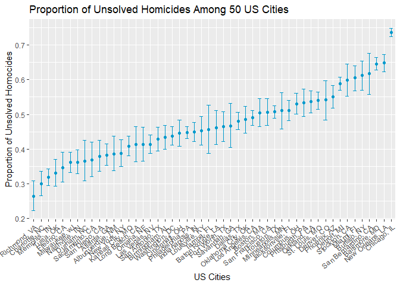

HW 5
================
Vanessa Dinh

## Problem 2

``` r
url = "https://raw.githubusercontent.com/washingtonpost/data-homicides/master/homicide-data.csv"

raw_wapo_homocide = 
  read_csv(url) %>% 
  janitor::clean_names()
```

    ## Rows: 52179 Columns: 12
    ## ── Column specification ────────────────────────────────────────────────────────
    ## Delimiter: ","
    ## chr (9): uid, victim_last, victim_first, victim_race, victim_age, victim_sex...
    ## dbl (3): reported_date, lat, lon
    ## 
    ## ℹ Use `spec()` to retrieve the full column specification for this data.
    ## ℹ Specify the column types or set `show_col_types = FALSE` to quiet this message.

The raw data has 52,179 observations of homicide data displaying city,
state, reported homocide date, victim demographics (first name, last
name, race, age, and sex), the latitude and longitude of the location of
the homocide, and the disposition of the homocide case (open or closed).

``` r
wapo_homocide =
  raw_wapo_homocide %>% 
  mutate(
    state = case_when(
      city == "Tulsa" & state == "AL" ~ "OK",
      TRUE ~ as.character(state)),
    city_state = paste(city, state, sep = ", "),
    disposition = as.factor(disposition),
    city_state = as.factor(city_state),
    uid = as.factor(uid)
  ) 

unsolved_homocide = 
  wapo_homocide %>% 
  group_by(city_state) %>% 
  summarize(
    num_unsolved_homocide = sum(disposition != "Closed by arrest"),
    num_homocides = n()
    ) 
```

``` r
balti_homocides =
  unsolved_homocide %>%
  filter(city_state == "Baltimore, MD") 

balti_x = balti_homocides %>% pull(num_unsolved_homocide)
balti_n = balti_homocides %>% pull(num_homocides)

proptest_balti = 
  prop.test(
     balti_x,
     balti_n, 
     alternative = c("two.sided"), 
     conf.level = 0.95,
     correct = TRUE) %>% 
  broom::tidy() %>% 
  janitor::clean_names() %>% 
  select(estimate, conf_low, conf_high)
```

``` r
prop_test_city = function(x) {
  
  city_df =
  unsolved_homocide %>% 
    filter(city_state == x)
  
  city_x = city_df %>% pull(num_unsolved_homocide)
  city_n = city_df %>% pull(num_homocides)
  
  prop_test_x =
  prop.test(
     city_x,
     city_n, 
     alternative = c("two.sided"), 
     conf.level = 0.95,
     correct = TRUE) %>% 
  broom::tidy() %>% 
  janitor::clean_names() %>% 
  select(estimate, conf_low, conf_high)
  
prop_test_x
}

prop_test_city(unsolved_homocide$city_state[[3]])
```

    ## # A tibble: 1 × 3
    ##   estimate conf_low conf_high
    ##      <dbl>    <dbl>     <dbl>
    ## 1    0.646    0.628     0.663

``` r
map(unsolved_homocide$city_state, prop_test_city)
```

    ## [[1]]
    ## # A tibble: 1 × 3
    ##   estimate conf_low conf_high
    ##      <dbl>    <dbl>     <dbl>
    ## 1    0.386    0.337     0.438
    ## 
    ## [[2]]
    ## # A tibble: 1 × 3
    ##   estimate conf_low conf_high
    ##      <dbl>    <dbl>     <dbl>
    ## 1    0.383    0.353     0.415
    ## 
    ## [[3]]
    ## # A tibble: 1 × 3
    ##   estimate conf_low conf_high
    ##      <dbl>    <dbl>     <dbl>
    ## 1    0.646    0.628     0.663
    ## 
    ## [[4]]
    ## # A tibble: 1 × 3
    ##   estimate conf_low conf_high
    ##      <dbl>    <dbl>     <dbl>
    ## 1    0.462    0.414     0.511
    ## 
    ## [[5]]
    ## # A tibble: 1 × 3
    ##   estimate conf_low conf_high
    ##      <dbl>    <dbl>     <dbl>
    ## 1    0.434    0.399     0.469
    ## 
    ## [[6]]
    ## # A tibble: 1 × 3
    ##   estimate conf_low conf_high
    ##      <dbl>    <dbl>     <dbl>
    ## 1    0.505    0.465     0.545
    ## 
    ## [[7]]
    ## # A tibble: 1 × 3
    ##   estimate conf_low conf_high
    ##      <dbl>    <dbl>     <dbl>
    ## 1    0.612    0.569     0.654
    ## 
    ## [[8]]
    ## # A tibble: 1 × 3
    ##   estimate conf_low conf_high
    ##      <dbl>    <dbl>     <dbl>
    ## 1    0.300    0.266     0.336
    ## 
    ## [[9]]
    ## # A tibble: 1 × 3
    ##   estimate conf_low conf_high
    ##      <dbl>    <dbl>     <dbl>
    ## 1    0.736    0.724     0.747
    ## 
    ## [[10]]
    ## # A tibble: 1 × 3
    ##   estimate conf_low conf_high
    ##      <dbl>    <dbl>     <dbl>
    ## 1    0.445    0.408     0.483
    ## 
    ## [[11]]
    ## # A tibble: 1 × 3
    ##   estimate conf_low conf_high
    ##      <dbl>    <dbl>     <dbl>
    ## 1    0.530    0.500     0.560
    ## 
    ## [[12]]
    ## # A tibble: 1 × 3
    ##   estimate conf_low conf_high
    ##      <dbl>    <dbl>     <dbl>
    ## 1    0.481    0.456     0.506
    ## 
    ## [[13]]
    ## # A tibble: 1 × 3
    ##   estimate conf_low conf_high
    ##      <dbl>    <dbl>     <dbl>
    ## 1    0.542    0.485     0.598
    ## 
    ## [[14]]
    ## # A tibble: 1 × 3
    ##   estimate conf_low conf_high
    ##      <dbl>    <dbl>     <dbl>
    ## 1    0.588    0.569     0.608
    ## 
    ## [[15]]
    ## # A tibble: 1 × 3
    ##   estimate conf_low conf_high
    ##      <dbl>    <dbl>     <dbl>
    ## 1    0.366    0.310     0.426
    ## 
    ## [[16]]
    ## # A tibble: 1 × 3
    ##   estimate conf_low conf_high
    ##      <dbl>    <dbl>     <dbl>
    ## 1    0.464    0.422     0.507
    ## 
    ## [[17]]
    ## # A tibble: 1 × 3
    ##   estimate conf_low conf_high
    ##      <dbl>    <dbl>     <dbl>
    ## 1    0.347    0.305     0.391
    ## 
    ## [[18]]
    ## # A tibble: 1 × 3
    ##   estimate conf_low conf_high
    ##      <dbl>    <dbl>     <dbl>
    ## 1    0.507    0.489     0.526
    ## 
    ## [[19]]
    ## # A tibble: 1 × 3
    ##   estimate conf_low conf_high
    ##      <dbl>    <dbl>     <dbl>
    ## 1    0.449    0.422     0.477
    ## 
    ## [[20]]
    ## # A tibble: 1 × 3
    ##   estimate conf_low conf_high
    ##      <dbl>    <dbl>     <dbl>
    ## 1    0.511    0.482     0.540
    ## 
    ## [[21]]
    ## # A tibble: 1 × 3
    ##   estimate conf_low conf_high
    ##      <dbl>    <dbl>     <dbl>
    ## 1    0.408    0.380     0.437
    ## 
    ## [[22]]
    ## # A tibble: 1 × 3
    ##   estimate conf_low conf_high
    ##      <dbl>    <dbl>     <dbl>
    ## 1    0.414    0.388     0.441
    ## 
    ## [[23]]
    ## # A tibble: 1 × 3
    ##   estimate conf_low conf_high
    ##      <dbl>    <dbl>     <dbl>
    ## 1    0.413    0.363     0.464
    ## 
    ## [[24]]
    ## # A tibble: 1 × 3
    ##   estimate conf_low conf_high
    ##      <dbl>    <dbl>     <dbl>
    ## 1    0.490    0.469     0.511
    ## 
    ## [[25]]
    ## # A tibble: 1 × 3
    ##   estimate conf_low conf_high
    ##      <dbl>    <dbl>     <dbl>
    ## 1    0.453    0.412     0.495
    ## 
    ## [[26]]
    ## # A tibble: 1 × 3
    ##   estimate conf_low conf_high
    ##      <dbl>    <dbl>     <dbl>
    ## 1    0.319    0.296     0.343
    ## 
    ## [[27]]
    ## # A tibble: 1 × 3
    ##   estimate conf_low conf_high
    ##      <dbl>    <dbl>     <dbl>
    ## 1    0.605    0.569     0.640
    ## 
    ## [[28]]
    ## # A tibble: 1 × 3
    ##   estimate conf_low conf_high
    ##      <dbl>    <dbl>     <dbl>
    ## 1    0.361    0.333     0.391
    ## 
    ## [[29]]
    ## # A tibble: 1 × 3
    ##   estimate conf_low conf_high
    ##      <dbl>    <dbl>     <dbl>
    ## 1    0.511    0.459     0.563
    ## 
    ## [[30]]
    ## # A tibble: 1 × 3
    ##   estimate conf_low conf_high
    ##      <dbl>    <dbl>     <dbl>
    ## 1    0.362    0.329     0.398
    ## 
    ## [[31]]
    ## # A tibble: 1 × 3
    ##   estimate conf_low conf_high
    ##      <dbl>    <dbl>     <dbl>
    ## 1    0.649    0.623     0.673
    ## 
    ## [[32]]
    ## # A tibble: 1 × 3
    ##   estimate conf_low conf_high
    ##      <dbl>    <dbl>     <dbl>
    ## 1    0.388    0.349     0.427
    ## 
    ## [[33]]
    ## # A tibble: 1 × 3
    ##   estimate conf_low conf_high
    ##      <dbl>    <dbl>     <dbl>
    ## 1    0.536    0.504     0.569
    ## 
    ## [[34]]
    ## # A tibble: 1 × 3
    ##   estimate conf_low conf_high
    ##      <dbl>    <dbl>     <dbl>
    ## 1    0.485    0.447     0.524
    ## 
    ## [[35]]
    ## # A tibble: 1 × 3
    ##   estimate conf_low conf_high
    ##      <dbl>    <dbl>     <dbl>
    ## 1    0.413    0.365     0.463
    ## 
    ## [[36]]
    ## # A tibble: 1 × 3
    ##   estimate conf_low conf_high
    ##      <dbl>    <dbl>     <dbl>
    ## 1    0.448    0.430     0.466
    ## 
    ## [[37]]
    ## # A tibble: 1 × 3
    ##   estimate conf_low conf_high
    ##      <dbl>    <dbl>     <dbl>
    ## 1    0.551    0.518     0.584
    ## 
    ## [[38]]
    ## # A tibble: 1 × 3
    ##   estimate conf_low conf_high
    ##      <dbl>    <dbl>     <dbl>
    ## 1    0.534    0.494     0.573
    ## 
    ## [[39]]
    ## # A tibble: 1 × 3
    ##   estimate conf_low conf_high
    ##      <dbl>    <dbl>     <dbl>
    ## 1    0.263    0.223     0.308
    ## 
    ## [[40]]
    ## # A tibble: 1 × 3
    ##   estimate conf_low conf_high
    ##      <dbl>    <dbl>     <dbl>
    ## 1    0.370    0.321     0.421
    ## 
    ## [[41]]
    ## # A tibble: 1 × 3
    ##   estimate conf_low conf_high
    ##      <dbl>    <dbl>     <dbl>
    ## 1    0.429    0.395     0.463
    ## 
    ## [[42]]
    ## # A tibble: 1 × 3
    ##   estimate conf_low conf_high
    ##      <dbl>    <dbl>     <dbl>
    ## 1    0.618    0.558     0.675
    ## 
    ## [[43]]
    ## # A tibble: 1 × 3
    ##   estimate conf_low conf_high
    ##      <dbl>    <dbl>     <dbl>
    ## 1    0.380    0.335     0.426
    ## 
    ## [[44]]
    ## # A tibble: 1 × 3
    ##   estimate conf_low conf_high
    ##      <dbl>    <dbl>     <dbl>
    ## 1    0.507    0.468     0.545
    ## 
    ## [[45]]
    ## # A tibble: 1 × 3
    ##   estimate conf_low conf_high
    ##      <dbl>    <dbl>     <dbl>
    ## 1    0.467    0.404     0.532
    ## 
    ## [[46]]
    ## # A tibble: 1 × 3
    ##   estimate conf_low conf_high
    ##      <dbl>    <dbl>     <dbl>
    ## 1    0.540    0.515     0.564
    ## 
    ## [[47]]
    ## # A tibble: 1 × 3
    ##   estimate conf_low conf_high
    ##      <dbl>    <dbl>     <dbl>
    ## 1    0.599    0.552     0.645
    ## 
    ## [[48]]
    ## # A tibble: 1 × 3
    ##   estimate conf_low conf_high
    ##      <dbl>    <dbl>     <dbl>
    ## 1    0.457    0.388     0.527
    ## 
    ## [[49]]
    ## # A tibble: 1 × 3
    ##   estimate conf_low conf_high
    ##      <dbl>    <dbl>     <dbl>
    ## 1    0.330    0.293     0.371
    ## 
    ## [[50]]
    ## # A tibble: 1 × 3
    ##   estimate conf_low conf_high
    ##      <dbl>    <dbl>     <dbl>
    ## 1    0.438    0.411     0.465

``` r
final_unsolved_df =
  unsolved_homocide %>% 
  mutate(summary = map(city_state, prop_test_city)) %>% 
  unnest(summary)
```

``` r
final_unsolved_df %>% 
  ggplot(aes(x = reorder(city_state, estimate), y = estimate)) +
  geom_point(aes(x = reorder(city_state, estimate), y = estimate), color = "deepskyblue3") +
  geom_errorbar(aes(ymin = conf_low, ymax = conf_high), color = "deepskyblue3", width = 0.5) +
  labs(
    title = "Proportion of Unsolved Homicides Among 50 US Cities",
    x = "US Cities",
    y = "Proportion of Unsolved Homocides"
  ) +
  theme(legend.position = "none") +
  scale_x_discrete(
    guide = guide_axis(angle = 40)
  )
```

<!-- -->

## Problem 3

``` r
# sim_power = function(n = 30, mu, sigma = 5) {
#   
#   sim_data = tibble(
#     x = rnorm(n, mean = mu, sd = sigma),
#   )
#   
#   sim_data %>% 
#     summarize(
#       mu_hat = mean(x),
#       signma_hat = sd(x)
#     )
# }
# 
# output = (0, 5000)
# 
# for (i in 1:5000) {
#   output[[i]] = sim_power
# }
# 
# sim_results = bind_rows(output)
```
