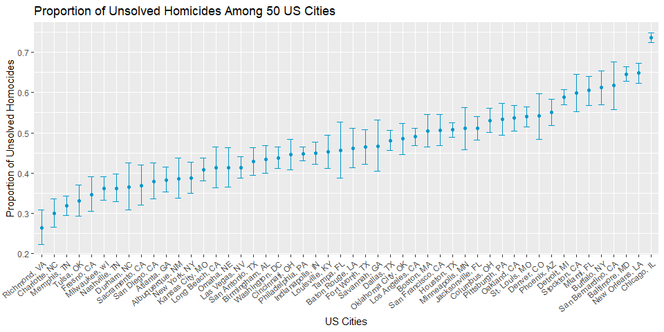
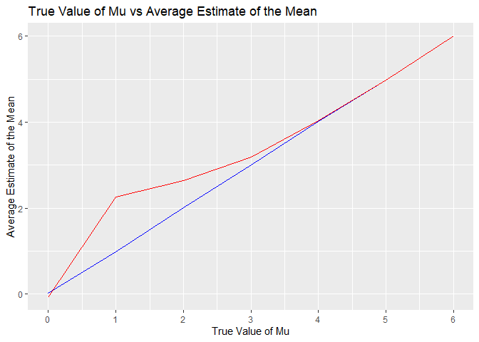
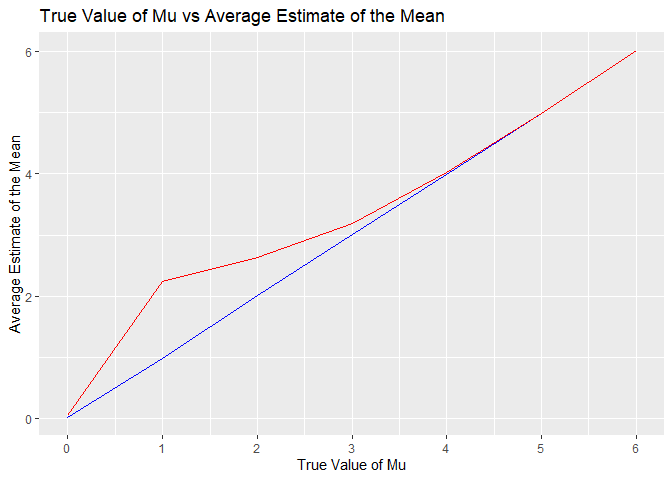

p8105_hw5_vd2407
================
Vanessa Dinh

``` r
library(tidyverse)
```

    ## ── Attaching packages ─────────────────────────────────────── tidyverse 1.3.2 ──
    ## ✔ ggplot2 3.3.6     ✔ purrr   0.3.4
    ## ✔ tibble  3.1.8     ✔ dplyr   1.0.9
    ## ✔ tidyr   1.2.0     ✔ stringr 1.4.1
    ## ✔ readr   2.1.2     ✔ forcats 0.5.2
    ## ── Conflicts ────────────────────────────────────────── tidyverse_conflicts() ──
    ## ✖ dplyr::filter() masks stats::filter()
    ## ✖ dplyr::lag()    masks stats::lag()

``` r
library(purrr)
```

## Problem 2

``` r
url = "https://raw.githubusercontent.com/washingtonpost/data-homicides/master/homicide-data.csv"

raw_wapo_homocide = 
  read_csv(url) %>% 
  janitor::clean_names()
```

    ## Rows: 52179 Columns: 12
    ## ── Column specification ────────────────────────────────────────────────────────
    ## Delimiter: ","
    ## chr (9): uid, victim_last, victim_first, victim_race, victim_age, victim_sex...
    ## dbl (3): reported_date, lat, lon
    ## 
    ## ℹ Use `spec()` to retrieve the full column specification for this data.
    ## ℹ Specify the column types or set `show_col_types = FALSE` to quiet this message.

The raw data has 52,179 observations of homicide data displaying city,
state, reported homocide date, victim demographics (first name, last
name, race, age, and sex), the latitude and longitude of the location of
the homocide, and the disposition of the homocide case (open or closed).

``` r
wapo_homocide =
  raw_wapo_homocide %>% 
  mutate(
    state = case_when(
      city == "Tulsa" & state == "AL" ~ "OK",
      TRUE ~ as.character(state)),
    city_state = paste(city, state, sep = ", "),
    disposition = as.factor(disposition),
    city_state = as.factor(city_state),
    uid = as.factor(uid)
  ) 

unsolved_homocide = 
  wapo_homocide %>% 
  group_by(city_state) %>% 
  summarize(
    num_unsolved_homocide = sum(disposition != "Closed by arrest"),
    num_homocides = n()
    ) 

unsolved_homocide %>% 
  knitr::kable()
```

| city_state         | num_unsolved_homocide | num_homocides |
|:-------------------|----------------------:|--------------:|
| Albuquerque, NM    |                   146 |           378 |
| Atlanta, GA        |                   373 |           973 |
| Baltimore, MD      |                  1825 |          2827 |
| Baton Rouge, LA    |                   196 |           424 |
| Birmingham, AL     |                   347 |           800 |
| Boston, MA         |                   310 |           614 |
| Buffalo, NY        |                   319 |           521 |
| Charlotte, NC      |                   206 |           687 |
| Chicago, IL        |                  4073 |          5535 |
| Cincinnati, OH     |                   309 |           694 |
| Columbus, OH       |                   575 |          1084 |
| Dallas, TX         |                   754 |          1567 |
| Denver, CO         |                   169 |           312 |
| Detroit, MI        |                  1482 |          2519 |
| Durham, NC         |                   101 |           276 |
| Fort Worth, TX     |                   255 |           549 |
| Fresno, CA         |                   169 |           487 |
| Houston, TX        |                  1493 |          2942 |
| Indianapolis, IN   |                   594 |          1322 |
| Jacksonville, FL   |                   597 |          1168 |
| Kansas City, MO    |                   486 |          1190 |
| Las Vegas, NV      |                   572 |          1381 |
| Long Beach, CA     |                   156 |           378 |
| Los Angeles, CA    |                  1106 |          2257 |
| Louisville, KY     |                   261 |           576 |
| Memphis, TN        |                   483 |          1514 |
| Miami, FL          |                   450 |           744 |
| Milwaukee, wI      |                   403 |          1115 |
| Minneapolis, MN    |                   187 |           366 |
| Nashville, TN      |                   278 |           767 |
| New Orleans, LA    |                   930 |          1434 |
| New York, NY       |                   243 |           627 |
| Oakland, CA        |                   508 |           947 |
| Oklahoma City, OK  |                   326 |           672 |
| Omaha, NE          |                   169 |           409 |
| Philadelphia, PA   |                  1360 |          3037 |
| Phoenix, AZ        |                   504 |           914 |
| Pittsburgh, PA     |                   337 |           631 |
| Richmond, VA       |                   113 |           429 |
| Sacramento, CA     |                   139 |           376 |
| San Antonio, TX    |                   357 |           833 |
| San Bernardino, CA |                   170 |           275 |
| San Diego, CA      |                   175 |           461 |
| San Francisco, CA  |                   336 |           663 |
| Savannah, GA       |                   115 |           246 |
| St. Louis, MO      |                   905 |          1677 |
| Stockton, CA       |                   266 |           444 |
| Tampa, FL          |                    95 |           208 |
| Tulsa, OK          |                   193 |           584 |
| Washington, DC     |                   589 |          1345 |

``` r
balti_homocides =
  unsolved_homocide %>%
  filter(city_state == "Baltimore, MD") 

balti_x = balti_homocides %>% pull(num_unsolved_homocide)
balti_n = balti_homocides %>% pull(num_homocides)

proptest_balti =
  prop.test(
     balti_x,
     balti_n, 
     alternative = c("two.sided"), 
     conf.level = 0.95,
     correct = TRUE) %>% 
  broom::tidy() %>% 
  janitor::clean_names() %>% 
  select(estimate, conf_low, conf_high) 

proptest_balti %>% 
  knitr::kable()
```

|  estimate |  conf_low | conf_high |
|----------:|----------:|----------:|
| 0.6455607 | 0.6275625 | 0.6631599 |

``` r
prop_test_city = function(x) {
  
  city_df =
  unsolved_homocide %>% 
    filter(city_state == x)
  
  city_x = city_df %>% pull(num_unsolved_homocide)
  city_n = city_df %>% pull(num_homocides)
  
  prop_test_x =
  prop.test(
     city_x,
     city_n, 
     alternative = c("two.sided"), 
     conf.level = 0.95,
     correct = TRUE) %>% 
  broom::tidy() %>% 
  janitor::clean_names() %>% 
  select(estimate, conf_low, conf_high)
  
prop_test_x
}

final_unsolved_df =
  unsolved_homocide %>% 
  mutate(summary = map(city_state, prop_test_city)) %>% 
  unnest(summary)

final_unsolved_df %>% 
  knitr::kable()
```

| city_state         | num_unsolved_homocide | num_homocides |  estimate |  conf_low | conf_high |
|:-------------------|----------------------:|--------------:|----------:|----------:|----------:|
| Albuquerque, NM    |                   146 |           378 | 0.3862434 | 0.3372604 | 0.4375766 |
| Atlanta, GA        |                   373 |           973 | 0.3833505 | 0.3528119 | 0.4148219 |
| Baltimore, MD      |                  1825 |          2827 | 0.6455607 | 0.6275625 | 0.6631599 |
| Baton Rouge, LA    |                   196 |           424 | 0.4622642 | 0.4141987 | 0.5110240 |
| Birmingham, AL     |                   347 |           800 | 0.4337500 | 0.3991889 | 0.4689557 |
| Boston, MA         |                   310 |           614 | 0.5048860 | 0.4646219 | 0.5450881 |
| Buffalo, NY        |                   319 |           521 | 0.6122841 | 0.5687990 | 0.6540879 |
| Charlotte, NC      |                   206 |           687 | 0.2998544 | 0.2660820 | 0.3358999 |
| Chicago, IL        |                  4073 |          5535 | 0.7358627 | 0.7239959 | 0.7473998 |
| Cincinnati, OH     |                   309 |           694 | 0.4452450 | 0.4079606 | 0.4831439 |
| Columbus, OH       |                   575 |          1084 | 0.5304428 | 0.5002167 | 0.5604506 |
| Dallas, TX         |                   754 |          1567 | 0.4811742 | 0.4561942 | 0.5062475 |
| Denver, CO         |                   169 |           312 | 0.5416667 | 0.4846098 | 0.5976807 |
| Detroit, MI        |                  1482 |          2519 | 0.5883287 | 0.5687903 | 0.6075953 |
| Durham, NC         |                   101 |           276 | 0.3659420 | 0.3095874 | 0.4260936 |
| Fort Worth, TX     |                   255 |           549 | 0.4644809 | 0.4222542 | 0.5072119 |
| Fresno, CA         |                   169 |           487 | 0.3470226 | 0.3051013 | 0.3913963 |
| Houston, TX        |                  1493 |          2942 | 0.5074779 | 0.4892447 | 0.5256914 |
| Indianapolis, IN   |                   594 |          1322 | 0.4493192 | 0.4223156 | 0.4766207 |
| Jacksonville, FL   |                   597 |          1168 | 0.5111301 | 0.4820460 | 0.5401402 |
| Kansas City, MO    |                   486 |          1190 | 0.4084034 | 0.3803996 | 0.4370054 |
| Las Vegas, NV      |                   572 |          1381 | 0.4141926 | 0.3881284 | 0.4407395 |
| Long Beach, CA     |                   156 |           378 | 0.4126984 | 0.3629026 | 0.4642973 |
| Los Angeles, CA    |                  1106 |          2257 | 0.4900310 | 0.4692208 | 0.5108754 |
| Louisville, KY     |                   261 |           576 | 0.4531250 | 0.4120609 | 0.4948235 |
| Memphis, TN        |                   483 |          1514 | 0.3190225 | 0.2957047 | 0.3432691 |
| Miami, FL          |                   450 |           744 | 0.6048387 | 0.5685783 | 0.6400015 |
| Milwaukee, wI      |                   403 |          1115 | 0.3614350 | 0.3333172 | 0.3905194 |
| Minneapolis, MN    |                   187 |           366 | 0.5109290 | 0.4585150 | 0.5631099 |
| Nashville, TN      |                   278 |           767 | 0.3624511 | 0.3285592 | 0.3977401 |
| New Orleans, LA    |                   930 |          1434 | 0.6485356 | 0.6231048 | 0.6731615 |
| New York, NY       |                   243 |           627 | 0.3875598 | 0.3494421 | 0.4270755 |
| Oakland, CA        |                   508 |           947 | 0.5364308 | 0.5040588 | 0.5685037 |
| Oklahoma City, OK  |                   326 |           672 | 0.4851190 | 0.4467861 | 0.5236245 |
| Omaha, NE          |                   169 |           409 | 0.4132029 | 0.3653146 | 0.4627477 |
| Philadelphia, PA   |                  1360 |          3037 | 0.4478103 | 0.4300380 | 0.4657157 |
| Phoenix, AZ        |                   504 |           914 | 0.5514223 | 0.5184825 | 0.5839244 |
| Pittsburgh, PA     |                   337 |           631 | 0.5340729 | 0.4942706 | 0.5734545 |
| Richmond, VA       |                   113 |           429 | 0.2634033 | 0.2228571 | 0.3082658 |
| Sacramento, CA     |                   139 |           376 | 0.3696809 | 0.3211559 | 0.4209131 |
| San Antonio, TX    |                   357 |           833 | 0.4285714 | 0.3947772 | 0.4630331 |
| San Bernardino, CA |                   170 |           275 | 0.6181818 | 0.5576628 | 0.6753422 |
| San Diego, CA      |                   175 |           461 | 0.3796095 | 0.3354259 | 0.4258315 |
| San Francisco, CA  |                   336 |           663 | 0.5067873 | 0.4680516 | 0.5454433 |
| Savannah, GA       |                   115 |           246 | 0.4674797 | 0.4041252 | 0.5318665 |
| St. Louis, MO      |                   905 |          1677 | 0.5396541 | 0.5154369 | 0.5636879 |
| Stockton, CA       |                   266 |           444 | 0.5990991 | 0.5517145 | 0.6447418 |
| Tampa, FL          |                    95 |           208 | 0.4567308 | 0.3881009 | 0.5269851 |
| Tulsa, OK          |                   193 |           584 | 0.3304795 | 0.2927201 | 0.3705039 |
| Washington, DC     |                   589 |          1345 | 0.4379182 | 0.4112495 | 0.4649455 |

``` r
final_unsolved_df %>% 
  ggplot(aes(x = reorder(city_state, estimate), y = estimate)) +
  geom_point(aes(x = reorder(city_state, estimate), y = estimate), color = "deepskyblue3") +
  geom_errorbar(aes(ymin = conf_low, ymax = conf_high), color = "deepskyblue3", width = 0.5) +
  labs(
    title = "Proportion of Unsolved Homicides Among 50 US Cities",
    x = "US Cities",
    y = "Proportion of Unsolved Homocides"
  ) +
  theme(legend.position = "none") +
  scale_x_discrete(
    guide = guide_axis(angle = 40)
  ) 
```



## Problem 3

``` r
sim_power = function(mu) {

  n = 30
  sigma = 5
  
  sim_data = tibble(
    x = rnorm(n, mean = mu, sd = sigma),
  ) 
  
  t.test(
    sim_data,
    alternative = c("two.sided"),
    mu = 0,
    conf.level = 0.95
  ) %>% 
    broom::tidy() %>% 
    janitor::clean_names() %>% 
    mutate(
      mu_hat = estimate
    ) %>% 
    select(mu_hat, p_value) 
}
```

``` r
sim_mu_zero_df =
  expand_grid(
    mu_input = 0,
    iter = 1:5000
  ) %>% 
  mutate(
    estimate_mu_zero_df = map(mu_input, sim_power)
  ) %>% 
  unnest(estimate_mu_zero_df) 
```

``` r
sim_mu_df =
  expand_grid(
    mu_input = 1:6,
    iter = 1:5000
  ) %>% 
  mutate(
    estimate_mu_df = map(mu_input, sim_power)
  ) %>% 
  unnest(estimate_mu_df)
```

``` r
sim_mu_plot_df =
  sim_mu_df %>%
  mutate(
    null_rej = case_when(
      p_value < 0.05 ~ 1,
      p_value >= 0.05 ~ 0
    ),
    mu_hat_null_rej = case_when(
      null_rej == 1 ~ mu_hat
    )
  ) %>% 
  group_by(mu_input) %>% 
  summarize(
    num_null_rej = sum(null_rej),
    total = n(),
    mean_mu_hat = mean(mu_hat),
    mean_mu_hat_null_rej = mean(mu_hat_null_rej, na.rm = TRUE)
  ) %>% 
  mutate(
    proportion_null_rej = num_null_rej/total
  ) 

sim_mu_plot_df %>% 
  knitr::kable()
```

| mu_input | num_null_rej | total | mean_mu_hat | mean_mu_hat_null_rej | proportion_null_rej |
|---------:|-------------:|------:|------------:|---------------------:|--------------------:|
|        1 |          918 |  5000 |   0.9993993 |             2.230856 |              0.1836 |
|        2 |         2793 |  5000 |   2.0085948 |             2.630322 |              0.5586 |
|        3 |         4419 |  5000 |   3.0122094 |             3.210226 |              0.8838 |
|        4 |         4938 |  5000 |   3.9768341 |             4.006204 |              0.9876 |
|        5 |         4998 |  5000 |   4.9954443 |             4.996700 |              0.9996 |
|        6 |         5000 |  5000 |   6.0103715 |             6.010371 |              1.0000 |

``` r
sim_mu_plot_df %>% 
  ggplot(aes(x = mu_input, y = proportion_null_rej)) +
  geom_col(fill = "darkolivegreen3", width = 0.5) +
  labs(
    title = "Power in One-Sample T-Test",
    x = "True Value of Mu",
    y = "Power or Proportion of Times Null Hypothesis was Rejected"
  ) +
  scale_x_continuous(
    breaks = c(1, 2, 3, 4, 5, 6),
    labels = c("1", "2", "3", "4", "5", "6")
  ) +
  scale_y_continuous(
    breaks = c(0.00, 0.25, 0.50, 0.75, 1.00),
    labels = c("0", "0.25", "0.50", "0.75", "1.00")
  ) 
```



The effect size can be described here as the difference between the true
value of mu and the null hypothesis that mu is equal to zero.

As effect size increases, power also increases, keeping sample size and
standard deviation is constant.

``` r
sim_mu_plot_df %>%
  ggplot(aes(x = mu_input, y = mean_mu_hat)) +
  geom_line(color = "blue") +
  geom_line(aes(x = mu_input, y = mean_mu_hat_null_rej), color = "red") +
  labs(
    title = "True Value of Mu vs Average Estimate of the Mean",
    x = "True Value of Mu",
    y = "Average Estimate of the Mean"
  ) +
  scale_x_continuous(
    breaks = c(1, 2, 3, 4, 5, 6),
    labels = c("1", "2", "3", "4", "5", "6")
  ) 
```


The sample average of mu hat across tests for which the null is rejected
is approximately equal to the true value of mu only when the true value
of mu is greater than or equal to 4. Otherwise, the sample average of mu
hat tends to be greater than the true value of mu when the true value of
mu is less than or equal to 3.

As the effect size increases, there is a smaller probability of a Type
II Error, which is an error that happens when one fails to reject the
null hypothesis that is actually false. As the probability of a Type II
Error decreases, there is an increasing proportion of samples that
correctly reject the null, so the average estimate of the expected mean
closer approximates the true value of mu.
